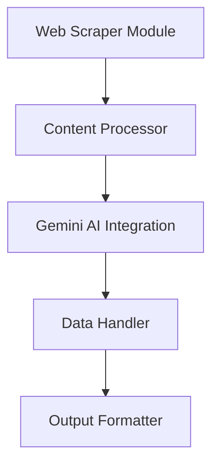

# System Patterns

## Architecture Overview
SmartScraper follows a modular architecture with clear separation of concerns:

## Core Components

### Web Scraper Module
- Handles web requests
- Manages sessions and cookies
- Implements retry logic
- Handles dynamic content

### Content Processor
- Extracts relevant content
- Preprocesses data for AI analysis
- Handles different content types
- Implements caching strategies

### Gemini AI Integration
- Manages API communication
- Implements prompt engineering
- Handles response processing
- Error handling and retries

### Data Handler
- Manages data storage
- Implements data validation
- Handles data transformations
- Ensures data integrity

### Output Formatter
- Formats data for export
- Supports multiple output formats
- Implements data cleaning
- Handles serialization

## Design Patterns

### Observer Pattern
- Used for event handling
- Monitors scraping progress
- Triggers notifications
- Manages async operations

### Factory Pattern
- Creates scraper instances
- Manages configuration
- Handles different content types
- Implements strategy selection

### Strategy Pattern
- Implements different scraping strategies
- Manages content processing approaches
- Handles various output formats
- Configures AI processing

### Singleton Pattern
- Manages API connections
- Controls resource usage
- Handles configuration
- Manages logging

## Error Handling
- Comprehensive error types
- Recovery strategies
- Logging mechanisms
- Retry policies

## Performance Considerations
- Caching strategies
- Rate limiting
- Resource management
- Optimization techniques

This document will be updated as system patterns evolve and new patterns emerge.
